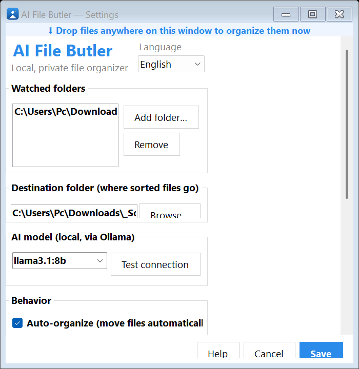
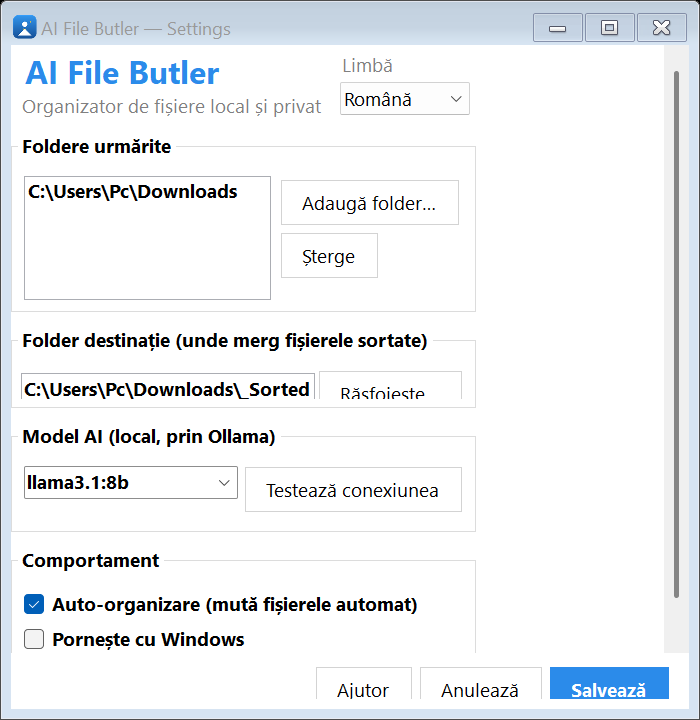

<div align="center">


# AI File Butler 🤵

**Your files, sorted. Privately.**

A Windows tray app that **reads** your documents with a local AI model, renames
them intelligently, files them away — and **learns** from your corrections.
**100% offline. Nothing ever leaves your PC.**

[](https://github.com/ForgeLabsSoft/ai-file-butler/releases/latest)
[](https://ko-fi.com/driveforge)
[](LICENSE.txt)

</div>

> `IMG_2931.pdf` → `Invoice_BMW_Service_2026-06.pdf` in `Invoices/`

---

## ✨ Why it's different

Other organizers are either **dumb** rule engines or **cloud** services that read
your files on someone else's servers. This one is **both smart *and* private** —
the AI runs locally, so your invoices, contracts and IDs stay yours.

|  | AI File Butler |
|--|----------------|
| 🧠 **Reads content** | Understands what's *inside* a file, not just its extension |
| 📄 **Text · PDF · photos** | Extracts PDF text and OCRs photos/scans (built-in Windows OCR) |
| ✍️ **Smart renaming** | `scan_4471.pdf` → `Invoice_Glovo_88231.pdf` — vendor, subject, date |
| 🎬 **Rich media sorting** | Movies by **genre/lead actor/year**, music by **artist/genre/year** (ID3 tags), invoices split into **Clients / Distributors** |
| 📸 **Photo sorting** | Photos by **date taken**, **GPS location** (offline nearest-city), or **people** — all on-device, no cloud |
| 🧑 **Face recognition** | Enroll people by example (People tab) and photos sort into `People/<Name>` — matched against **every** face in the shot, not just the biggest. Small on-device model, downloaded once (~13 MB) |
| 🔎 **Semantic search** | Find files in **plain language** — "my car insurance", "that NHS letter from spring" — with on-device embeddings (Ollama). Press **Ctrl+K**. Nothing leaves your PC |
| 👀 **Preview & undo** | See every planned move (file → new name → folder → why) and untick anything **before** it happens; one-click undo of any batch |
| ⚙️ **Content-aware rules** | *field × operator × action*: "content contains IBAN → Invoices", "extension is .tmp → skip". Your rules beat the AI, with a live **Test** |
| ⏰ **Expiry reminders** | Reads expiry dates (passport/visa via ICAO MRZ, insurances, car tax…) and reminds you. Three buckets — **Documents · Renewals · Tasks** — with recurring tasks and **.ics** calendar export |
| 📅 **Memories** | "On this day" — resurfaces photos you took on today's date in past years |
| 🎓 **Learns from you** | Move a file once; similar files follow next time |
| 🔒 **100% offline** | No cloud, no account, no telemetry |
| 🛡️ **Safe by default** | First run starts in **manual mode** — nothing moves until you opt in |
| 🤔 **Never guesses** | Unsure files go to a **`_Review`** folder instead of being mis-filed |
| ↩️ **Always safe** | Never overwrites · one-click Undo · dry-run friendly |
| 🌍 **16 languages** | Full UI + notifications localized |

## 🖼️ Screenshots

| English | Română |
|---|---|
|  |  |

## 🚀 Install

1. **[Download `AIFileButler-Setup.exe`](https://github.com/ForgeLabsSoft/ai-file-butler/releases/latest)** and run it (per-user, no admin).
2. The 🤵 icon appears next to your clock. Right-click it → **Settings…**
3. Pick the folders to watch and you're done.

> **"Windows protected your PC"?** The direct download isn't code-signed yet, so
> Windows may show this — click **More info → Run anyway**. It's safe and 100%
> offline (verify it yourself on [VirusTotal](https://www.virustotal.com)). Free
> code signing for this open-source project — via the
> [SignPath Foundation](https://signpath.org) — is **in progress**. The Microsoft
> Store build is signed by Microsoft and won't show this warning.

> First run starts in **manual mode** — nothing moves until you choose a folder and
> click **Organize now**, then enable Auto-organize when you're happy.

### Unlock smart AI mode (optional)
Without it the Butler still sorts by rules. For content-aware AI naming:
```powershell
# install Ollama from https://ollama.com, then:
ollama pull llama3.1:8b        # content-aware naming + expiry reading
ollama pull nomic-embed-text   # enables 🔎 semantic search (small, ~270 MB)
```
Next scan, the status line shows **AI (Ollama)** and renaming gets smart. For
search, open the **Search** tab and click **Rebuild index** once. Everything runs
locally — nothing is uploaded.

## 🧠 How it works

```
file ─► reads content (text / PDF / OCR) ─► local AI picks category + name ─► moves it ─► learns
```

1. **Watches** the folders you choose.
2. **Reads** each new file — text, PDFs, even photos/scans (OCR).
3. **Decides** the right category and a clean new name with a local AI model.
4. **Files** it (into sub-folders by genre/artist/year/party — your choice in Settings),
   notifies you, and remembers any correction you make.

## 🌍 Languages

English · 中文 · हिन्दी · Español · Français · العربية · বাংলা · Português ·
Русский · Indonesia · Deutsch · 日本語 · 한국어 · Italiano · Türkçe · Română

Change it any time in **Settings → Language**.

## 🔒 Privacy

The AI model runs **on your machine** via [Ollama](https://ollama.com). No servers,
no accounts, no uploads, no telemetry. Your documents never leave your computer.

## 🔏 Code signing

The **Microsoft Store** build is signed by Microsoft. For the direct download,
free code signing for this open-source project via the
**[SignPath Foundation](https://signpath.org)** is **in progress** — until it goes
live the installer is unsigned (see the "Run anyway" note above). Builds are
produced reproducibly via GitHub Actions.

## 📄 License & privacy

- **License:** [GNU GPL-3.0](LICENSE.txt) — free and open source. You may use,
  study, share and modify it; any distributed modifications must stay open under
  the GPL. © 2026 ForgeLabsSoft.
- **Privacy:** nothing leaves your device — no accounts, servers, or telemetry.
  See [PRIVACY.txt](PRIVACY.txt).
- **Third-party components:** see [THIRD-PARTY-NOTICES.txt](THIRD-PARTY-NOTICES.txt).

## ☕ Support

AI File Butler is **free**. If it saves you time, a small tip keeps it alive:
**[ko-fi.com/driveforge](https://ko-fi.com/driveforge)** 🤍

## 📦 Build from source

Requires .NET 10 SDK (Windows).
```powershell
dotnet run -c Release                       # run the tray app
dotnet publish -c Release -r win-x64 -p:PublishSingleFile=true --self-contained true
& "$env:LOCALAPPDATA\Programs\Inno Setup 6\ISCC.exe" installer\AIFileButler.iss   # build installer
```

---

<div align="center"><sub>Built with .NET 10 · runs fully offline · made by ForgeLabsSoft</sub></div>
